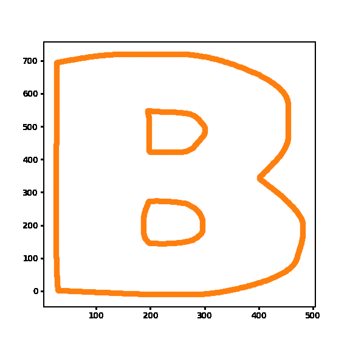
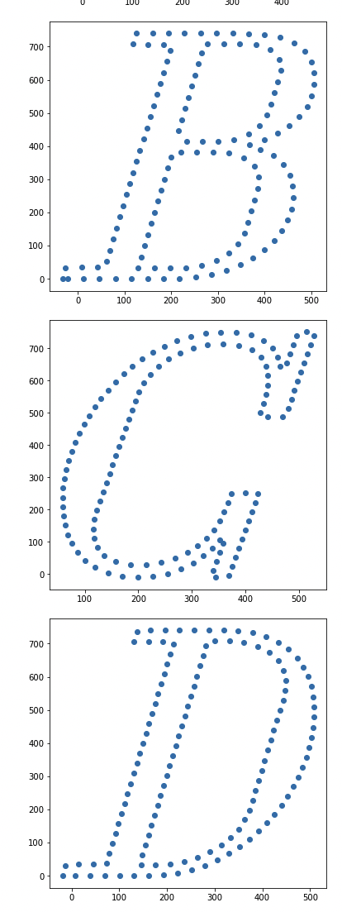

# vegetable
All about turning vector graphics into a set of points.

Remark:
- required packages not yet specified :p,(but it's numpy and fontTools). 

Motivation:
- machine learning on vector graphics using point cloud representations

This is a B rendered from 0 points to 128 points.



These are glyphs of a certain font rendered as a point sequence.




# carrot
This package contains a basis for handling vector graphics. 
It provides the powerful class called `VectorGraphic` which is
defined by:
- starting point: Tuple[float, float]
- ending point: Tuple[float, float]
- function: Callable[[float], Tuple[float, float]]:
  - this is a function that takes in a float and outputs the correspoinding point
  - f_t : it can either be a generic parameterization f(t) where t is not remarkable; or
  - f_portion_s: it can be f(s/L) where s is the arc length and L is a constant that refers to the length of this vector graphic
  - while you can specify both, it only keeps `f_portion_s`, if you pass in a `f_t`
- number of points for approximating this vector graphic as a point cloud/sequence: int

This class can have any weird f_t/f_portion_s as you like, but many times, you would like to use simpler segments and 
compose them into more complicated graphics. For this you have SVG inspired components: Line, QuadraticCurve 
provided by `carrot`. They have ready `f_t`/`f_portion_s` that they pass to VectorGraphic and they themselves are 
implementations of VectorGraphic. Do note that VectorGraphic is not an abstract class and can be used directly (if you 
can write down their parameterized functions). 

## Demo
This is how you create a vector graphic. Here we create them using the `VectorGraphic` class and the `QuadraticCurve` class.
```python
from carrot.vector_graphic import VectorGraphic
from carrot.svg import QuadraticCurve

vg = VectorGraphic(
  start_point=(0,1),
  end_point=(1,0),
  f_t=lambda t: (t, 1-t),
  num_points_for_approximation=10
)

curve = QuadraticCurve(
  start_point=(1,0),
  end_point=(2,3),
  control_point=(2.5, 1.5),
  num_points_for_approximation=10
)
```

A vector graphic has some highlight methods
- `get_as_point_sequence()` which returns an iterator of points equal to that passed in at the constructor(`num_points_for_approximation`)
- `get_approximate_length()` which returns the length of this vector graphic
- `__call__(portion_s)` which accepts a number in `[0,1]` which denotes `s/L` ~ `arc_length/total_length`

One thing you might want to do is get the vector graphic as a sequence of points.
```python
vg_points: List[Tuple[float, float]] = list(vg.get_as_point_sequence())
```

If you like them to be a numpy array, you can do the following.
```python
import numpy as np
vg_points: np.ndarray = np.array(list(vg.get_as_point_sequence()))
```

### Composing Vector Graphics from smaller ones
The neat thing about these, is you can add them together into one vector graphic. 

```python
new_vg = vg + curve
```

The result is itself a vector graphic.
No the result is not a collection of the two - there is no list that collects the pieces together - the new vector graphic
is itself a `VectorGraphic` object which means it defines its shape by `f_portion_s`; this means that it doesn't know 
it was composed of smaller segments and it acts just like any other vector graphic. 

Another cool feature is that you don't need the smaller pieces to be connected (connected means: end point of the first == start point of the second). 
So you can create entire logos, figures, with all just 1 vector graphic object.

This feature wherein the sum of 2 vector graphics is also a vector graphic allows it to be rendered as a point sequence where
the adjacent points are equally spaced.

# broccoli
This package uses `carrot` in order to deliver the following.
- a TrueType `ttf` font reader that has a `read_font(...)` method that returns a `Font` object
- `Font` class that has a name, and a `__call__(glyph_name)` that returns a `Glyph` object if the glyph exists, and raises a `KeyError`, otherwise.
- `Glyph` class which is a `VectorGraphic` object and has an additional name property

## Demo
Say you have a `ttf` file somewhere and you want to get the glyphs A,B,a,b and you want to make point clouds out of them.

You first read the font to the get a `Font` object back. After that, you can access the glyphs in the font.
```python
from broccoli.ttf.ttf_reader import TTFReader
font_file_path = "/somewhere/out/there/font_name-italic.ttf"
glyphs_you_want: str = "ABab"
reader = TTFReader(glyph_names_to_read_in_font_files=glyphs_you_want, num_points_for_glyph_as_sequence=128, num_points_for_internal_approximation=2)
font = reader.read_font(font_file_path)

# get the glyph you want
point_cloud = {}
for glyph_name in glyphs_you_want:
    glyph = font(glyph_name)
    # remember that glyph is a VectorGraphic
    point_cloud[glyph.name] = list(glyph.get_as_point_sequence())
```

Additionally, you can make numpy arrays from them with the coordinates scaled from -1 to 1 (which is preferred for machine learning).
```python
from broccoli.utils.font_to_numpy import font_to_numpy

font_as_numpy_array = font_to_numpy(font)
```

### Insight to how this reader works
This reader works by reading the `ttf` and finding the `ttglyfs` that you specified. For each of those glyph specification it then finds the contours of a glpyh. Each contour is a sequence of lines or
curves (encoded as a sequence of on and off points) and each of those is converted as a `VectorGraphic` object. 
Then, the glyph is then just the sum of all these `VectorGraphic` objects.
